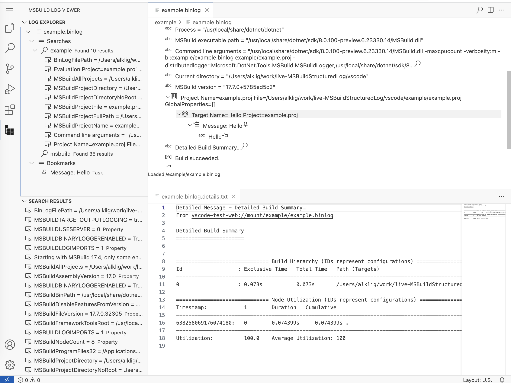

# MSBuild Structured Log Viewer

A viewer for MSBuild `.binlog` files based on
Kirill Osenkov's [structured log viewer](https://msbuildlog.com) right inside VS Code: navigate a structured representation of executed targets, tasks, property and item values. It can greatly simplify build investigations.

The viewer has some unique features compared to the standalone app:

- Multiple searches per binlog
- Ability to bookmark log entries while exploring a binlog
- Open long log entires in editor tabs

Works on desktops, Codespaces and on <https://insiders.vscode.dev> using the [Experimental: WebAssembly Execution Engine](https://marketplace.visualstudio.com/items?itemName=ms-vscode.wasm-wasi-core) extension ([read more](https://code.visualstudio.com/blogs/2023/06/05/vscode-wasm-wasi)) using .NET 8's `wasi-experimental` workload

